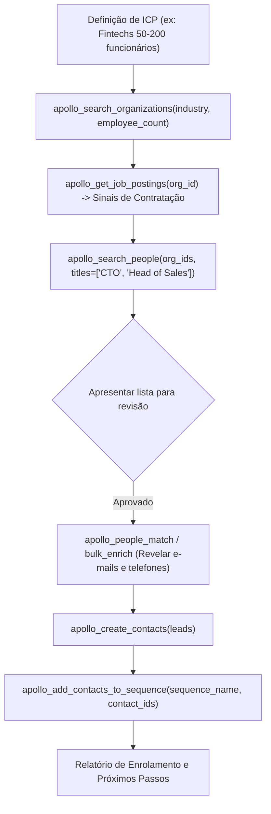

# Inteligência de Vendas e Prospecção B2B com Apollo.io

O **Apollo.io** é uma das maiores plataformas globais de inteligência de vendas (GTM), engajamento e dados B2B do mundo, com uma base de mais de 275 milhões de contatos e 73 milhões de empresas.

Esta skill orienta o uso do servidor oficial MCP do Apollo (`https://mcp.apollo.io/mcp`), permitindo busca de leads por ICP (Ideal Customer Profile), enriquecimento individual e em massa de pessoas e empresas, captura de sinais de contratação (job postings), gestão de contatos e enrolled em cadências de cold outbound.

---

## Quando Usar Esta Skill

Ative esta skill quando a tarefa envolver:
- **Prospecção de Pessoas por Cargo e ICP (`apollo_search_people` / `apollo_mixed_people_api_search`)**: Encontrar tomadores de decisão (VPs, diretores, founders) por cargo, senioridade, localização e filtros de empresa.
- **Prospecção e Mapeamento de Organizações (`apollo_search_organizations` / `apollo_mixed_companies_search`)**: Buscar empresas por setor, porte, faturamento, localização geográfica e palavras-chave.
- **Enriquecimento Individual e em Massa (`apollo_enrich_person`, `apollo_bulk_enrich_people`, `apollo_enrich_organization`, `apollo_people_match`)**: Descobrir e-mails corporativos verificados, telefones diretos (direct dials), URLs do LinkedIn e dados tecnográficos/firmográficos a partir de um nome, domínio ou perfil.
- **Sinais de Intenção e Vagas Abertas (`apollo_get_job_postings`)**: Identificar empresas contratando para tecnologias específicas ou cargos-chave como termômetro de expansão e intenção de compra.
- **Gestão de Contatos e Sequências (`apollo_create_contacts`, `apollo_add_contacts_to_sequence`, `apollo_search_sequences`)**: Salvar leads no CRM do Apollo e adicioná-los diretamente a fluxos de cold mailing.
- **Métricas e Sales Analytics (`apollo_analytics_sync_report`)**: Analisar desempenho de cadências, taxas de resposta, chamadas e reuniões agendadas.

---

## Autenticação e Como Obter a API Key

O servidor MCP do Apollo suporta dois modos de conexão:
1. **API Key via Header (`X-Api-Key`) — Recomendado no Startuzeiro**:
   - Crie uma conta gratuita em [Apollo.io](https://www.apollo.io/).
   - Acesse **Settings** (ícone de engrenagem) ➔ **Integrations** ➔ **API Keys** (ou direto em `https://app.apollo.io/#/settings/integrations/api_keys`).
   - Clique em **Create New Key** (ou use a Master API Key).
   - Defina um nome descritivo (ex: `Antigravity Startuzeiro`) e copie a chave gerada.
   - Salve no seu `.env` local: `APOLLO_API_KEY=sua_chave_aqui`.
2. **OAuth 2.0**:
   - Em clientes como Claude Desktop ou Claude Code, o login interativo abre a janela de autorização em `https://app.apollo.io/oauth/authorize`.

---

## As Ferramentas do Servidor Apollo MCP

| Categoria | Ferramentas Principais | Finalidade | Efeito nos Créditos |
| :--- | :--- | :--- | :--- |
| **Pesquisa de Pessoas** | `apollo_search_people` / `apollo_mixed_people_api_search` | Busca de decisores por cargo, nível hierárquico, localidade e empresa. | Leitura (0 créditos) |
| **Pesquisa de Empresas** | `apollo_search_organizations` / `apollo_mixed_companies_search` | Busca de empresas por setor, faixa de funcionários, faturamento e tecnologias. | Leitura (0 créditos) |
| **Sinais de Vagas** | `apollo_get_job_postings` | Lista vagas ativas da empresa para identificar projetos e tecnologias em uso. | Leitura (0 créditos) |
| **Enriquecimento de Pessoas** | `apollo_enrich_person`, `apollo_people_match`, `apollo_bulk_enrich_people` | Revela e-mail verificado, telefone celular/direto e perfil profissional completo. | Consome créditos |
| **Enriquecimento de Empresas** | `apollo_enrich_organization`, `apollo_organizations_bulk_enrich` | Traz receita anual, stack de tecnologias, links sociais e filiais. | Consome créditos |
| **Criação de Contatos** | `apollo_create_contacts`, `apollo_update_contacts` | Insere os leads prospectados no workspace do Apollo. | Sem custo adicional |
| **Sequências & Outbound** | `apollo_search_sequences`, `apollo_add_contacts_to_sequence`, `apollo_list_email_accounts` | Enrola os contatos qualificados em cadências de e-mails personalizadas. | Disparo de mensagens |
| **Relatórios de Vendas** | `apollo_analytics_sync_report` | Puxa métricas de envio, aberturas, respostas e ligações da equipe. | Leitura |

---

## Fluxo Operacional Recomendado (GTM & Outbound Pipeline)

---

## Sinergia com o Ecossistema Startuzeiro

O Apollo complementa perfeitamente as ferramentas já instaladas:

1. **Brasil x Internacional**:
   - Para empresas brasileiras com foco societário e QSA: use **cnpj.ai** para identificar os sócios legais e quadro administrativo.
   - Para contatos globais e tomadores de decisão operacionais: use **Apollo** e **Hunter**.
2. **Dupla Verificação de E-mails (Apollo + Hunter)**:
   - Obtenha os leads no **Apollo** com enriquecimento de telefones e dados firmográficos.
   - Use o `Email-Verifier` do **Hunter** para auditar a entregabilidade dos e-mails antes de acionar sequências.
3. **Descoberta Contextual (Exa + Apollo)**:
   - Use o **Exa** para identificar notícias recentes, rodadas de investimento ou dores de mercado.
   - Use o **Apollo** para encontrar os executivos responsáveis por aquela vertical e obter seus contatos.

---

## Diretrizes de Segurança e Créditos

> [!WARNING]
> - **Confirmação Prévia para Enriquecimento**: Enriquecer contatos consome créditos do plano do Apollo. Em pesquisas volumosas, liste primeiro os nomes e empresas encontradas (busca gratuita) antes de executar o enriquecimento de e-mails e telefones.
> - **Sequências de E-mail**: Adicionar contatos a uma sequência ativa pode disparar e-mails reais imediatamente dependendo da configuração da campanha. Sempre confirme o nome da sequência e a conta de envio antes de executar.
