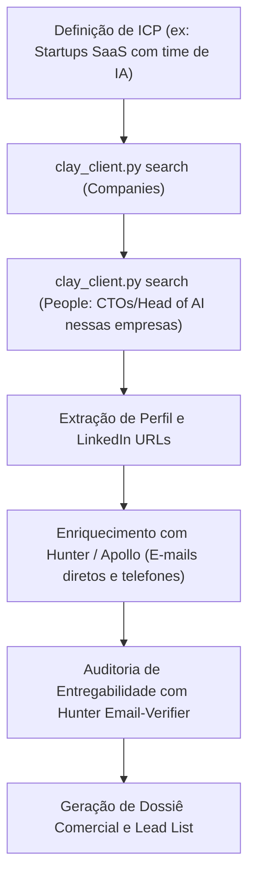

# Inteligência de Dados GTM e Enriquecimento com Clay

O **Clay** (https://clay.com) é a plataforma líder global de enriquecimento de dados e orquestração de Go-To-Market (GTM), integrando mais de 150 provedores de dados e inteligência artificial para prospecção, qualificação e criação de fluxos de vendas altamente personalizados.

No Startuzeiro, o Clay opera através de duas superfícies complementares:
1. **Clay Public API v0 (`https://api.clay.com/public/v0`)**: Execução programática de buscas SQL-like no banco GTM global da Clay (`people` e `companies`) e disparo assíncrono de rotinas e funções de enriquecimento.
2. **Clay MCP Server (`https://api.clay.com/v3/mcp`)**: Conexão com agentes de IA via Model Context Protocol para pesquisa, auditoria de tabelas e enriquecimento interativo.

---

## Quando Usar Esta Skill

Ative esta skill quando a tarefa envolver:
- **Busca de Empresas no Banco GTM da Clay**: Localizar empresas por setor, faturamento, faixa de funcionários, tecnologias utilizadas ou presença de cargos específicos (ex: `select from companies where people.exists(job_title is_similar_to ("VP Sales"))`).
- **Busca de Decisores e Pessoas**: Encontrar executivos atuais ou passados com critérios de cargo, empresa e localização (ex: `select from people where experiences.any(is_current = true and job_title is_similar_to ("CTO"))`).
- **Consultas com Sintaxe Cruzada (Cross-Entity Queries)**: Buscar pessoas com base em características da empresa (ex: `experiences.any(company.technographics.any(vendor = "Salesforce"))`).
- **Execução de Rotinas e Funções Personalizadas**: Disparar funções de enriquecimento em lote (waterfall) para obter e-mails, dados financeiros ou resumos de IA.
- **Consulta da Gramática de Campos**: Obter os campos e operadores suportados atualizados em tempo real.

---

## Modos de Operação no Startuzeiro

### 1. Utilitário CLI Nativo (`clay_client.py`)
Para executar consultas de forma rápida e segura no terminal sem depender de binários externos:

```bash
# Buscar empresas por setor ou atributos
uv run scripts/utilitarios/clay_client.py search "select from companies where industry = 'Software Development' limit 5"

# Buscar decisores (pessoas) atuais
uv run scripts/utilitarios/clay_client.py search 'select from people where experiences.any(is_current = true and job_title is_similar_to ("CTO"))' --limit 5

# Consultar a gramática completa e catálogo de campos
uv run scripts/utilitarios/clay_client.py reference

# Disparar uma rotina/função customizada da Clay
uv run scripts/utilitarios/clay_client.py routine <routine_id> '{"items": [{"id": "1", "inputs": {"domain": "empresa.com"}}]}'
```

### 2. Servidor MCP (`https://api.clay.com/v3/mcp`)
- Configurado globalmente no `~/.gemini/config/mcp_config.json`.
- Permite que o assistente consulte tabelas e dispare rotinas interativamente.

---

## Gramática de Consulta do Banco Clay (Query Mode)

As buscas no banco da Clay utilizam a linguagem SQL-like estruturada:

### Estrutura Básica
```sql
select from <people | companies>
where <condicoes>
```

### Principais Operadores e Padrões

| Operador / Padrão | Descrição | Exemplo |
| :--- | :--- | :--- |
| `is_similar_to ("termo")` | Similaridade semântica para cargos | `job_title is_similar_to ("VP Engineering")` |
| `contains ("termo1", "termo2")` | Contém qualquer uma das palavras | `description contains ("saas", "fintech")` |
| `experiences.any(...)` | Filtra histórico profissional de pessoas | `experiences.any(is_current = true and company.industry = "Software")` |
| `people.exists(...)` | Filtra empresas que empregam perfis específicos | `people.exists(is_current = true and job_title is_similar_to ("Head of AI"))` |
| `locations.any(...)` | Filtra localização geográfica da sede ou filial | `locations.any(is_headquarters = true and country_name = "Brazil")` |
| `technographics.any(...)` | Filtra stack tecnológica da empresa | `company.technographics.any(vendor = "Stripe")` |

> [!NOTE]
> Os valores de busca textual (setores, cargos e tecnologias) devem ser passados em inglês para melhor cobertura do índice da Clay.

---

## Fluxo Recomendado de Prospecção GTM



---

## Sinergia com o Ecossistema Startuzeiro

O Clay potencializa a esteira de dados do laboratório:

1. **Clay + Hunter.io**: Use o Clay para localizar as empresas e os nomes/perfis de decisores e o Hunter para verificar detalhadamente a entregabilidade e DNS/MX do domínio.
2. **Clay + Apollo.io**: Use o banco do Clay para filtros avançados de stack tecnológica e o Apollo para telefones celulares diretos e sinais de contratação recentes.
3. **Clay + cnpj.ai**: Use o cnpj.ai para investigar a estrutura jurídica brasileira de uma empresa e o Clay para mapear as contas e contatos globais correspondentes.
4. **Clay + Exa**: Use o Exa para pesquisas contextuais na web aberta e o Clay para enriquecimento estruturado de registros.
