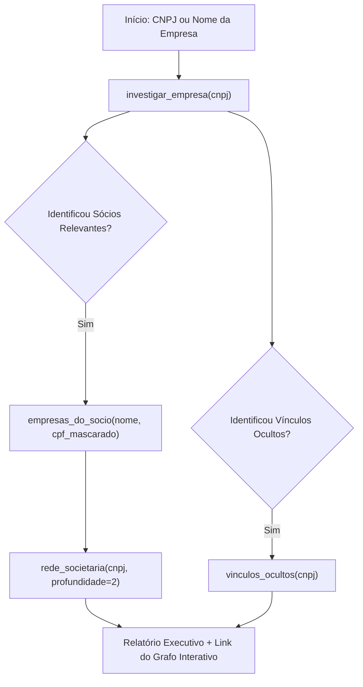

# Investigação Empresarial e Societária com cnpj.ai

Utilize o servidor MCP do **cnpj.ai** para consultar a base oficial de 72+ milhões de CNPJs da Receita Federal do Brasil, histórico de sócios, redes societárias em até 3 níveis e registros de dívida ativa da União (PGFN).

## Quando Usar Esta Skill

Ative esta skill quando a tarefa envolver:
- Investigação cadastral de uma empresa brasileira por CNPJ ou Razão Social.
- Identificação de quem está por trás de uma empresa (sócios, administradores, QSA).
- Mapeamento de outras empresas pertencentes a um sócio pessoa física.
- Descoberta de grupos econômicos de fato ou redes informais via contatos compartilhados (vínculos ocultos).
- Verificação de conexões societárias ou menor caminho entre dois CNPJs.
- Filtragem e listagem de empresas por CNAE, porte, estado (UF), município ou regime tributário (Simples/MEI).
- Panorama econômico e contagens empresariais por região.

---

## As 11 Ferramentas Disponíveis

| Ferramenta | Entrada Principal | Finalidade |
| :--- | :--- | :--- |
| `investigar_empresa` | `cnpj` (14 ou 8 dígitos), `incluir_cadeia` (bool) | **Ponto de partida recomendado**. Retorna ficha cadastral completa, QSA com peso de sócios, situação cadastral, dívida ativa PGFN e vínculos ocultos imediatos. |
| `buscar_empresas` | `termo` (razão social, fantasia ou CNPJ) | Busca empresas no Brasil por nome ou número quando não se tem o CNPJ exato. |
| `ficha_cnpj` | `cnpj` (14 dígitos) | Ficha cadastral detalhada e individual de um estabelecimento específico (matriz ou filial). |
| `buscar_socios` | `nome` (pessoa física) | Localiza sócios por nome em todo o território nacional. |
| `empresas_do_socio` | `nome`, `cpf_mascarado` | Lista todas as empresas ativas ou inativas vinculadas ao par (nome, CPF mascarado). |
| `rede_societaria` | `cnpj`, `profundidade` (1 a 3) | Mapeia as relações societárias diretas e indiretas de uma empresa em até 3 graus. |
| `encontrar_conexao` | `origem`, `destino` (CNPJs) | Descobre o menor caminho societário entre duas empresas (até 6 saltos). |
| `vinculos_ocultos` | `cnpj` (14 ou 8 dígitos) | Identifica outras empresas que compartilham o mesmo telefone ou e-mail cadastrado na Receita Federal. |
| `panorama_empresarial` | `uf`, `cidade` (opcionais) | Gera contagens, distribuição por situação, principais CNAEs e porte no Brasil, UF ou município. |
| `listar_empresas` | filtros (`cnae`, `uf`, `porte`, `situacao`, etc.) | Prospecção estruturada de empresas com base em critérios operacionais e geográficos. |
| `buscar_cnae` | `atividade` (texto livre) | Converte termos livres (ex: "energia solar", "marketing") em códigos oficiais CNAE de 7 dígitos. |

---

## Fluxo Recomendado de Investigação



### 1. Investigação Inicial (Dossiê Express)
Comece sempre por:
```json
investigar_empresa(cnpj="00.000.000/0001-00")
```
Analise o retorno:
- **Situação cadastral:** Ativa, baixada, inapta ou suspensa.
- **QSA:** Quem são os administradores e sócios, e quantas outras empresas cada um possui (`empresas_total`).
- **Dívida Ativa PGFN:** Registros pendentes de débitos federais em cobrança.
- **Vínculos Ocultos:** Empresas associadas por dados de contato idênticos.

### 2. Aprofundamento nos Controladores
Para sócios com `empresas_total > 1`:
```json
empresas_do_socio(nome="Nome do Sócio", cpf_mascarado="***123456**")
```

### 3. Expansão da Rede e Conexões
Para entender holdings e empresas coligadas:
```json
rede_societaria(cnpj="00000000", profundidade=2)
```

### 4. Prospecção de Mercado / Leads B2B
Quando o objetivo for listar concorrentes ou clientes em potencial:
1. Resolva o CNAE: `buscar_cnae(atividade="agência de marketing")`
2. Filtre os leads: `listar_empresas(cnae="7311400", uf="SP", situacao="02")`

---

## Diretrizes de Relatório
- **Apresente o link do grafo interativo:** As respostas do cnpj.ai incluem links como `https://grafo.cnpj.ai/?q=<cnpj_basico>`, que devem ser entregues ao usuário para inspeção visual.
- **Ressalva de Vínculos de Contato:** Deixe claro que e-mails e telefones idênticos podem indicar o mesmo escritório de contabilidade ou grupo econômico informal, e não constituem automaticamente fraude.
- **Competência das Fontes:** Cite sempre que os dados são públicos e originados da base oficial da Receita Federal e PGFN.
