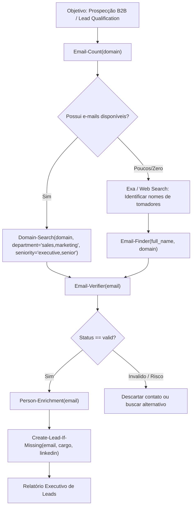

# Inteligência de Contatos B2B e E-mails com Hunter.io

O **Hunter.io** é a plataforma de referência global para descoberta e verificação de e-mails corporativos, mapeamento de equipes por domínio corporativo e enriquecimento de dados de prospecção.

Esta skill orienta o uso do servidor MCP do Hunter (`https://mcp.hunter.io/mcp`), abrangendo pesquisa de domínios, localização de e-mails de tomadores de decisão, verificação de entregabilidade (bounce prevention), enriquecimento de dados e gerenciamento de leads.

---

## Quando Usar Esta Skill

Ative esta skill quando a tarefa envolver:
- **Pesquisa de E-mails por Domínio (`Domain-Search`)**: Mapear contatos, departamentos e tomadores de decisão de uma empresa a partir do seu domínio web (ex: `empresa.com`).
- **Localização de E-mail Específico (`Email-Finder`)**: Encontrar o e-mail corporativo direto de um profissional sabendo seu nome completo e domínio da empresa.
- **Validação e Verificação de Entregabilidade (`Email-Verifier`)**: Checar se um e-mail é válido, deliverable, se possui MX ativo, SMTP aceito, ou se é catch-all/disposable antes de enviar mensagens.
- **Descoberta Gratuita de Empresas (`Find-Companies`)**: Buscar empresas por segmento, localização, porte e palavras-chave sem consumir créditos.
- **Enriquecimento B2B (`Person-Enrichment`, `Company-Enrichment`, `Combined-Enrichment`)**: Obter cargo, LinkedIn, setor, tecnologias e dados cadastrais a partir de um e-mail ou domínio.
- **Gestão de Leads e CRM (`Create-Lead`, `Push-Leads-To-CRM`, `Save-Company`)**: Salvar e organizar contatos qualificados em listas de prospecção.
- **Campanhas de Outreach (`Create-Sequence`, `Add-Sequence-Recipients`)**: Estruturar e monitorar cadências de cold mailing.

---

## Ferramentas Principais e Como Utilizar

O Hunter MCP dispõe de 102 ferramentas especializadas. As ferramentas centrais do fluxo de inteligência são:

### 1. Pesquisa & Descoberta

| Ferramenta | Parâmetros Principais | Consumo | Finalidade |
| :--- | :--- | :--- | :--- |
| `Domain-Search` | `domain` (obrigatório), `limit`, `department`, `seniority`, `type` (`personal`/`generic`), `required_field` | 1 crédito | Lista contatos e e-mails de um domínio corporativo com filtros de departamento e cargo. |
| `Email-Finder` | `full_name`, `domain` (ambos obrigatórios) | 1 crédito | Descobre o e-mail de um profissional específico dentro de um domínio. |
| `Email-Verifier` | `email` (obrigatório) | 0.5 crédito | Valida entregabilidade, status SMTP, MX records e score de confiança (0 a 100). |
| `Email-Count` | `domain` | Gratuito (0 créditos) | Retorna o total de e-mails catalogados disponíveis para o domínio antes de gastar créditos. |
| `Find-Companies` | `query` (ex: "SaaS companies in Brazil") | Gratuito (0 créditos) | Descoberta aberta de empresas com base em filtros textuais. |

### 2. Enriquecimento de Dados

| Ferramenta | Parâmetros Principais | Finalidade |
| :--- | :--- | :--- |
| `Person-Enrichment` | `email` | Retorna nome, cargo, redes sociais (LinkedIn, Twitter), empresa e localização do indivíduo. |
| `Company-Enrichment` | `domain` | Retorna descrição, setor, tamanho da equipe, país, links sociais e tecnologias do domínio. |
| `Combined-Enrichment` | `email` | Enriquece dados da pessoa física e da empresa contratante simultaneamente. |

### 3. Gestão de Leads e Listas

| Ferramenta | Parâmetros Principais | Finalidade |
| :--- | :--- | :--- |
| `Create-Lead` | `email`, `first_name`, `last_name`, `position`, `company`, `linkedin_url`, `leads_list_id` | Salva o contato como lead oficial na conta do Hunter (0 créditos). |
| `Create-Lead-If-Missing` | `email`, dados do lead | Salva o lead somente se ainda não existir no cadastro. |
| `List-Leads` / `Get-Lead` | filtros (`query`, `limit`, etc.) | Consulta leads já salvos e históricos. |
| `List-Leads-Lists` / `Create-Leads-List` | `name` | Gerencia pastas e listas segmentadas de prospecção. |
| `Push-Leads-To-CRM` | `lead_ids`, `connected_app_id` | Exporta leads qualificados para CRMs integrados (HubSpot, Pipedrive, Salesforce). |

### 4. Monitoramento de Créditos e Conta

| Ferramenta | Finalidade |
| :--- | :--- |
| `Get-Account-Details` | Exibe plano atual, total de créditos disponíveis, créditos consumidos e data de renovação. |
| `Get-Usage` | Consulta consumo detalhado da equipe no ciclo de faturamento atual. |

---

## Fluxo Operacional Recomendado (Pipeline de Prospecção)

---

## Integração com Outras Ferramentas do Startuzeiro

O Hunter opera de forma sinérgica com os outros motores de pesquisa instalados:

1. **Investigação Nacional Completa (cnpj.ai + Hunter)**:
   - Use `cnpj.ai` (`investigar_empresa` / `buscar_socios`) para identificar o QSA e administradores de uma empresa brasileira.
   - Use `hunter` (`Email-Finder` com o nome do sócio e o domínio do site) para encontrar o e-mail de contato corporativo e direto do executivo.
2. **Descoberta Web e Enriquecimento Semântico (Exa + Hunter)**:
   - Use `Exa` (`web_search_exa` ou `agent_run`) para mapear concorrentes, notícias ou teses de mercado.
   - Use `hunter` (`Domain-Search`) para levantar os responsáveis pelas áreas de produto, compras ou parcerias das empresas encontradas.
3. **Extração de Conteúdo e Contatos de Landing Pages (Firecrawl + Hunter)**:
   - Use `Firecrawl` (`firecrawl_scrape`) para raspar a página "Sobre nós" ou "Time".
   - Use `hunter` para validar e auditar a entregabilidade dos e-mails extraídos.

---

## Boas Práticas e Preservação de Créditos

> [!TIP]
> - **Consulte `Email-Count` antes**: Verificar a contagem de e-mails em um domínio é gratuito e evita rodar `Domain-Search` em empresas que não possuem e-mails registrados no índice.
> - **`Find-Companies` é 100% gratuito**: Use a busca aberta do Hunter para listar empresas alvo sem descontar créditos do plano.
> - **Filtre por Cargo e Departamento**: Em domínios grandes (ex: `stripe.com`, `nubank.com.br`), sempre especifique `department` (ex: `it`, `executive`, `sales`) e `seniority` (ex: `executive`, `senior`) para não estourar a cota com e-mails irrelevantes.
> - **Prevenção de Bounces**: Sempre verifique e-mails com `Email-Verifier` antes de estruturar sequências de cold outreach para proteger a reputação do domínio remetente.
